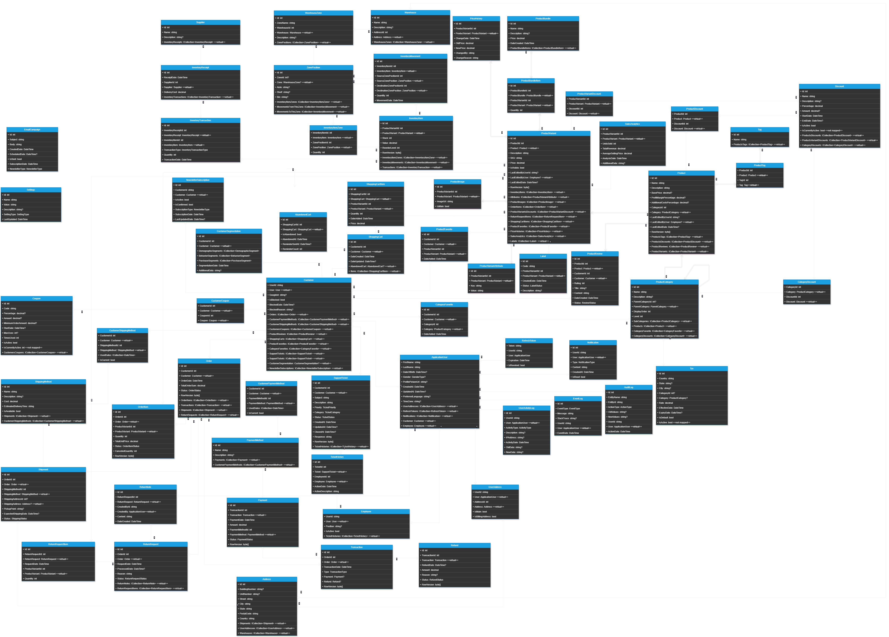

# Database Schema

## Overview

This document outlines the key classes in the e-commerce application, detailing their fields, relationships, and overall functionality. Each class plays a vital role in managing various aspects of the system, from user management to order processing and support ticket handling.

## Entities

### 1. **ApplicationUser**
- **Fields**:
  - **FirstName** (`string`): Stores the user's first name with a maximum length of 100 characters.
  - **LastName** (`string`): Stores the user's last name with a maximum length of 100 characters.
  - **DateOfBirth** (`DateTime?`): Optional field that records the user's date of birth.
  - **Gender** (`GenderType?`): Nullable field representing the user's gender. This field is limited to 10 characters and corresponds to an enum `GenderType`.
  - **ProfilePictureUrl** (`string?`): Optional field storing the URL of the user's profile picture.
  - **CreatedAt** (`DateTime`): A required field that stores the date and time when the user was created, defaulting to the current UTC time.
  - **UpdatedAt** (`DateTime?`): Nullable field storing the date and time when the user's record was last updated.
  - **PreferredLanguage** (`string?`): An optional field for storing the user's preferred language for localization purposes.
  - **TimeZone** (`string?`): An optional field that stores the user's time zone to adjust dates and times according to their local time.
  
- **Relationships**:
  - **Customer** (`virtual Customer?`): Optional relationship indicating that this user can be associated with a `Customer` entity.
  - **Employee** (`virtual Employee?`): Optional relationship indicating that this user can be associated with an `Employee` entity.
  - **UserAddresses** (`virtual ICollection<UserAddress>`): Collection of addresses linked to the user, allowing for multiple addresses.
  - **RefreshTokens** (`virtual ICollection<RefreshToken>`): Collection of refresh tokens issued to the user for managing session security.
  - **Notifications** (`virtual ICollection<Notification>`): Collection of notifications associated with the user, facilitating user-specific alerts and updates.

- **Description**:  
  The `ApplicationUser` class represents a user within the application, inheriting from `IdentityUser` to leverage built-in authentication and identity management features. This class includes various personal and application-related attributes such as user details, localization settings, and relationships with other entities like `Customer`, `Employee`, `UserAddress`, `RefreshToken`, and `Notification`.

### 2. **Customer**
- **Fields**:
  - **UserId** (`string`): Primary key that uniquely identifies the customer, corresponding to the `ApplicationUser` entity.
  - **User** (`virtual ApplicationUser`): The associated `ApplicationUser` entity linked via a foreign key.
  - **GoogleId** (`string?`): Optional unique identifier provided by Google for users who authenticate via Google.
  - **IsBlocked** (`bool`): Indicates whether the customer is blocked from accessing their account.
  - **BlockedDate** (`DateTime?`): Optional field recording the date when the customer was blocked, if applicable.
  - **BlockedReason** (`string?`): Optional field specifying the reason for blocking the customer.

  
- **Relationships**:
  - **Orders** (`virtual ICollection<Order>`): Collection of orders placed by the customer, initialized to an empty list.
  - **CustomerPaymentMethods** (`virtual ICollection<CustomerPaymentMethod>`): Collection of payment methods linked to the customer.
  - **CustomerShippingMethods** (`virtual ICollection<CustomerShippingMethod>`): Collection of shipping methods associated with the customer.
  - **CustomersCoupons** (`virtual ICollection<CustomerCoupon>`): Collection of coupons available to the customer.
  - **ProductReviews** (`virtual ICollection<ProductReview>`): Collection of product reviews submitted by the customer.
  - **ShoppingCarts** (`virtual ICollection<ShoppingCart>`): Collection of shopping carts created by the customer.
  - **ProductFavorites** (`virtual ICollection<ProductFavorite>`): Collection of the customer's favorite products.
  - **CategoryFavorites** (`virtual ICollection<CategoryFavorite>`): Collection of the customer's favorite categories.
  - **SupportTickets** (`virtual ICollection<SupportTicket>`): Collection of support tickets submitted by the customer for assistance or issues.
  - **CustomerSegmentation** (`virtual CustomerSegmentation?`): Optional field linking the customer to segmentation data for marketing or analytics purposes.
  - **NewsletterSubscriptions** (`virtual ICollection<NewsletterSubscription>`): Collection of newsletter subscriptions opted into by the customer.

- **Description**:  
  The `Customer` class represents users who interact with the e-commerce platform to browse products, place orders, and engage with support services. Inheriting from `ApplicationUser`, it includes fields specific to customers such as `GoogleId` for authentication through Google services, and flags indicating whether the customer is currently blocked from accessing their account along with details about the blocking reason and date. The various one-to-many relationships with classes like `Order`, `ProductReview`, and `SupportTicket` illustrate the customer's active role in the platform, enabling comprehensive tracking of their activities, preferences, and interactions.

### 3. **Employee**
- **Fields**:
  - **UserId** (`string`): Primary key that uniquely identifies the employee, corresponding to the `ApplicationUser` entity.
  - **User** (`virtual ApplicationUser`): The associated `ApplicationUser` entity linked via a foreign key.
  - **Position** (`string`): Represents the job title or position of the employee within the organization.
  - **IsActive** (`bool`): Indicates whether the employee is currently active. This field is required and defaults to `true`.

- **Relationships**:
  - **TicketHistories** (`virtual ICollection<TicketHistory>`): A collection that tracks the history of actions taken by the employee on support tickets. This is initialized to an empty list to avoid null reference issues.

- **Description**:  
  The `Employee` class represents users who are responsible for managing customer inquiries, support tickets, and related activities within the application. As a subclass of `ApplicationUser`, it inherits core user attributes while adding specific fields relevant to employees. The `Position` field allows for categorization of employees based on their roles, facilitating easier management and reporting. The `IsActive` flag indicates whether an employee is currently employed and available to handle support tasks. The relationship with `TicketHistory` enables tracking of actions taken by employees on support tickets, ensuring accountability and providing insights into employee performance.

### 4. **RefreshToken**
- **Fields**:
  - `Token`: Unique identifier for the refresh token (Primary Key).
  - `UserId`: ID of the user associated with this refresh token (Required).
  - `Expiration`: Date and time when the refresh token expires (Required).
  - `IsRevoked`: Indicates whether the token has been revoked (Default: `false`).

- **Relationships**:
  - **ApplicationUser**: Many-to-One (A `RefreshToken` is associated with one `User`).

- **Description**:  
  The `RefreshToken` class is used to maintain user sessions in applications that implement token-based authentication. It serves as a secure mechanism to obtain new access tokens without requiring the user to re-enter their credentials. The refresh token is tied to a specific user and contains an expiration date to enhance security. The `IsRevoked` field allows for immediate invalidation of the token, ensuring that compromised tokens can be disabled promptly. By associating each `RefreshToken` with an `ApplicationUser`, the system can effectively manage user sessions, providing a seamless user experience while ensuring the integrity of authentication processes.

### 5. **UserAddress**
- **Fields**:
  - `UserId`: ID of the user associated with the address (Required).
  - `AddressId`: ID of the address associated with the user (Required).
  - `IsMain`: Indicates whether the address is the primary address for the user (Default: `true`).
  - `IsBillingAddress`: Indicates whether the address is used for billing (Default: `true`).

- **Relationships**:
  - **ApplicationUser**: Many-to-One (A `User` can be linked to multiple `UserAddress` records).
  - **Address**: Many-to-One (An `Address` can be associated with multiple `UserAddress` records).

- **Description**:  
  The `UserAddress` class serves as a linking entity between users and their addresses, allowing for flexible management of multiple addresses per user. Each entry can denote whether the address is the primary (main) address and if it is designated for billing purposes. This setup facilitates efficient handling of user address data within applications that require address management, such as e-commerce platforms or service delivery systems. By linking the `ApplicationUser` and `Address` classes, the system can maintain a comprehensive overview of a user's address landscape, making it easier to manage user preferences and fulfill orders correctly.

### 6. **SupportTicket**
- **Fields**:
  - `Id`: Unique identifier for the support ticket (Primary Key).
  - `CustomerId`: Identifier of the customer who submitted the ticket (Required).
  - `Subject`: The subject of the support ticket (Required, Max length: 255).
  - `Description`: Detailed description of the issue or request in the ticket (Required).
  - `Priority`: Priority level of the support ticket (Required, Enum: `TicketPriority`).
  - `Category`: Category of the support ticket (Required, Enum: `TicketCategory`).
  - `Status`: Current status of the support ticket (Required, Enum: `TicketStatus`).
  - `CreatedAt`: Date and time when the ticket was created (Required).
  - `UpdatedAt`: Date and time when the ticket was last updated (Optional).
  - `ClosedAt`: Date and time when the ticket was closed (Optional).
  - `Response`: Response provided by the employee handling the ticket (Optional).
  - `RowVersion`: Version of the entity for optimistic concurrency control (Timestamp).

- **Relationships**:
  - **Customer**: Many-to-One (A `Customer` can submit many `SupportTicket`s).
  - **TicketHistory**: One-to-Many (A `SupportTicket` can have many `TicketHistory` records).

- **Description**:  
  The `SupportTicket` class is designed to track customer inquiries, issues, and requests within a support system. Each ticket includes key details such as the subject, description, and associated priority and category. The status of the ticket is updated as it moves through different stages (open, in progress, closed), and timestamps are used to log creation, updates, and closure. This model provides a comprehensive view of the support lifecycle, enabling effective management and resolution of customer concerns. The relationships with the `Customer` and `TicketHistory` classes facilitate easy tracking of who submitted the ticket and the actions taken throughout its resolution.

### 7. **TicketHistory**
- **Fields**:
  - `Id`: Unique identifier for the ticket history record (Primary Key).
  - `TicketId`: Identifier of the associated support ticket (Required, Foreign Key).
  - `EmployeeId`: Identifier of the employee who performed the action (Required, Foreign Key).
  - `ActionDate`: Date and time when the action was performed (Required).
  - `ActionDescription`: Description of the action performed (Required, Max length: 1000).

- **Relationships**:
  - **SupportTicket**: Many-to-One (Each `TicketHistory` record is tied to one `SupportTicket`).
  - **Employee**: Many-to-One (Each `TicketHistory` record is tied to one `Employee`).

- **Description**:  
  The `TicketHistory` class maintains a log of actions taken on each support ticket, allowing for a detailed audit trail of the ticket's lifecycle. It includes the identifier of the employee who performed each action, the date and time of the action, and a description outlining what was done. This model is essential for tracking the progress of support requests, ensuring accountability, and improving customer service by allowing teams to review the history of interactions related to a specific ticket. The relationships with the `SupportTicket` and `Employee` classes enable seamless tracking and association of actions with the responsible individuals.

### 8. **CustomerShippingMethod**
- **Fields**:
  - `CustomerId`: Identifier of the customer associated with the shipping method (Required, Foreign Key).
  - `ShippingMethodId`: Identifier of the associated shipping method (Required, Foreign Key).
  - `UsedDates`: List of dates when this shipping method was used (Required, typically stored as a collection).
  - `IsCurrent`: Flag indicating if this is the current shipping method (Required).

- **Relationships**:
  - **Customer**: Many-to-One (Each `CustomerShippingMethod` is tied to one `Customer`).
  - **ShippingMethod**: Many-to-One (Each `CustomerShippingMethod` is tied to one `ShippingMethod`).

- **Description**:  
  The `CustomerShippingMethod` class serves to associate a specific shipping method with a customer, tracking how and when the method has been utilized. This model allows customers to select from their preferred shipping methods during checkout and provides a historical record of their usage. The `IsCurrent` field identifies the shipping method currently preferred by the customer, enabling a smoother and more personalized shopping experience. By establishing relationships with the `Customer` and `ShippingMethod` classes, this model facilitates efficient shipping management and customer preferences.

### 9. **Shipment**
- **Fields**:
  - `Id`: Unique identifier for the shipment (Primary Key).
  - `OrderId`: Identifier of the order associated with the shipment (Required, Foreign Key).
  - `ShippingMethodId`: Identifier of the shipping method used for the shipment (Required, Foreign Key).
  - `ShippingAddressId`: Identifier of the address associated with the shipment (Nullable, Foreign Key).
  - `PickupPoint`: Location where the order can be picked up by the customer (Nullable).
  - `ExpectedShippingDate`: Expected date of delivery (Nullable).
  - `Status`: Current status of the shipment (Required, max length 50).

- **Relationships**:
  - **Order**: Many-to-One (Each `Shipment` is linked to a specific `Order`).
  - **ShippingMethod**: Many-to-One (Each `Shipment` uses a specific `ShippingMethod`).
  - **Address**: Optional Many-to-One (Each `Shipment` may have an associated delivery `Address`).

- **Description**:  
  The `Shipment` class represents the process of delivering an order to a customer. It includes details such as the associated order, the shipping method used, the delivery address, and the status of the shipment. By tracking expected shipping dates and pickup locations, this model ensures effective communication with customers about their orders and delivery options. The relationships with `Order`, `ShippingMethod`, and `Address` enable a comprehensive view of the shipping process and allow for flexibility in managing deliveries.

### 10. **ShippingMethod**
- **Fields**:
  - `Id`: Unique identifier for the shipping method (Primary Key).
  - `Name`: Name of the shipping method (Required, max length 100).
  - `Description`: Description of the shipping method (Nullable, max length 500).
  - `Cost`: Cost of using this shipping method (Required, must be greater than zero, decimal).
  - `EstimatedDeliveryTime`: Estimated delivery time for this shipping method (Required, max length 50).
  - `IsAvailable`: Availability status of the shipping method (Required, defaults to true).

- **Relationships**:
  - **Shipment**: One-to-Many (A `ShippingMethod` can be associated with multiple `Shipment`s).
  - **CustomerShippingMethod**: One-to-Many (A `ShippingMethod` can be associated with multiple `CustomerShippingMethod`s).

- **Description**:  
  The `ShippingMethod` class represents various options available for delivering products to customers. It includes essential details like the name, cost, estimated delivery time, and availability status. This model allows for flexible shipping options and provides customers with clear information about their delivery choices. The relationships with `Shipment` and `CustomerShippingMethod` facilitate the tracking of shipments and allow for personalized shipping methods for customers, ensuring that the system can adapt to individual preferences and needs.

### 11. **Order**
- **Fields**:
  - `Id`: Unique identifier for the order (Primary Key).
  - `CustomerId`: ID of the customer associated with the order (Required).
  - `OrderDate`: Date when the order was placed (Required).
  - `TotalOrderSum`: Total sum of the order (Required, Decimal).
  - `Status`: Status of the order (Required).
  - `RowVersion`: Version of the entity for optimistic concurrency control (Used for concurrency management).

- **Relationships**:
  - **Customer**: Many-to-One (An `Order` is associated with one `Customer`).
  - **OrderItem**: One-to-Many (An `Order` can have multiple `OrderItem`s).
  - **Transaction**: One-to-Many (An `Order` can have multiple `Transaction`s).
  - **Shipment**: One-to-Many (An `Order` can have multiple `Shipment`s).
  - **ReturnRequest**: One-to-Many (An `Order` can have multiple `ReturnRequest`s).

- **Description**:  
  The `Order` class encapsulates all the information related to a customer's order, including the customer who placed it, the date of the order, the total sum, and its current status. This model is essential for managing the order lifecycle, from creation through fulfillment to potential returns. The relationships with `OrderItem`, `Transaction`, `Shipment`, and `ReturnRequest` facilitate detailed tracking and management of the order's components, ensuring a smooth experience for both customers and administrators. The `RowVersion` field ensures that concurrent updates do not lead to data integrity issues, maintaining accurate order records in a multi-user environment.

### 12. **OrderItem**
- **Fields**:
  - `Id`: Unique identifier for the order item (Primary Key).
  - `OrderId`: ID of the order associated with the order item (Required).
  - `ProductVariantId`: ID of the product variant associated with the order item (Required).
  - `Quantity`: Quantity of the product in the order item (Required, must be a positive integer).
  - `TotalUnitPrice`: Unit price of the product in the order item (Required, Decimal).
  - `Status`: Status of the order item (Required, defaults to Pending).
  - `CanceledQuantity`: Quantity of the order item that was canceled (Defaults to 0).
  - `RowVersion`: Version of the entity for optimistic concurrency control (Used for concurrency management).

- **Relationships**:
  - **Order**: Many-to-One (An `OrderItem` is associated with one `Order`).
  - **ProductVariant**: Many-to-One (An `OrderItem` is associated with one `ProductVariant`).

- **Description**:  
  The `OrderItem` class represents an individual item within an order, detailing the specific product variant ordered, the quantity purchased, and the pricing information. This structure allows for precise tracking of what each order consists of, enabling the e-commerce application to handle processing, cancellations, and inventory management efficiently. The inclusion of `Status` and `CanceledQuantity` fields helps in managing order fulfillment and handling customer inquiries related to their purchases. The `RowVersion` is crucial for ensuring data integrity during concurrent updates, providing a mechanism to manage versioning and prevent conflicts.

### 13. **ReturnNote**
- **Fields**:
  - `Id`: Unique identifier for the return note (Primary Key).
  - `ReturnRequestId`: ID of the return request associated with this note (Required).
  - `CreatedById`: ID of the user who created the note (Required).
  - `Content`: Content of the note (Required, max length of 1000 characters).
  - `DateCreated`: Date when the note was created (Required, defaults to the current UTC date and time).

- **Relationships**:
  - **ReturnRequest**: Many-to-One (A `ReturnNote` is associated with one `ReturnRequest`).
  - **CreatedBy**: Many-to-One (A `ReturnNote` is created by one `User`).

- **Description**:  
  The `ReturnNote` class represents comments or additional information regarding a specific return request. It captures the details of who created the note and when, along with the content of the note itself. This structure facilitates better communication and record-keeping within the return request process, allowing support staff or users to provide context or insights related to the return. The association with `ReturnRequest` enables linking notes directly to specific return cases, enhancing the overall customer service experience by providing a comprehensive view of each return request's history.

### 14. **ReturnRequest**
- **Fields**:
  - `Id`: Unique identifier for the return request (Primary Key).
  - `OrderId`: ID of the order associated with the return request (Required).
  - `RequestDate`: Date when the return request was created (Required).
  - `ProcessedDate`: Date when the return request was processed (nullable).
  - `Reason`: Reason for the return request (Required, max length of 500 characters).
  - `Status`: Status of the return request (Required).

- **Relationships**:
  - **Order**: Many-to-One (A `ReturnRequest` is associated with one `Order`).
  - **ReturnNotes**: One-to-Many (A `ReturnRequest` can have multiple associated `ReturnNote`s).
  - **ReturnRequestItems**: One-to-Many (A `ReturnRequest` can have multiple associated `ReturnRequestItem`s).

- **Description**:  
  The `ReturnRequest` class encapsulates the details of a customer's return request, including the order from which the items were purchased, the date of the request, and the reason for the return. This class serves as a central point for tracking the status of the return, processing dates, and any associated notes. The relationship with `ReturnRequestItems` allows for detailed tracking of which specific items are being returned and the reasons behind the request. This structure not only helps in managing returns efficiently but also enhances customer service by maintaining a comprehensive record of customer interactions related to returns.

### 15. **ReturnRequestItem**
- **Fields**:
  - `Id`: Unique identifier for the return request item (Primary Key).
  - `ReturnRequestId`: ID of the return request associated with this item (Required).
  - `ProductVariantId`: ID of the product variant being returned (Required).
  - `Quantity`: Quantity of the product being returned (Required, must be a positive integer).

- **Relationships**:
  - **ReturnRequest**: Many-to-One (A `ReturnRequestItem` is associated with one `ReturnRequest`).
  - **ProductVariant**: Many-to-One (A `ReturnRequestItem` is associated with one `ProductVariant`).

- **Description**:  
  The `ReturnRequestItem` class captures the details of items being returned as part of a return request. Each instance links back to the specific return request and the product variant being returned, ensuring accurate tracking and processing of returns. The quantity field specifies how many units of the product variant are being returned, which is essential for inventory management and customer service. This structure allows for efficient handling of returns, including adjustments to inventory levels and customer refunds, while maintaining a clear association with the overall return request.

### 16. **PriceHistory**
- **Fields**:
  - `Id`: Unique identifier for the price history record (Primary Key).
  - `ProductVariantId`: ID of the product variant that this price history record pertains to (Required).
  - `ChangeDate`: Date and time when the price change occurred (Required).
  - `OldPrice`: Old price before the change (Required, decimal with two decimal places).
  - `NewPrice`: New price after the change (Required, decimal with two decimal places).
  - `ChangedBy`: Identifier of the person or system that made the change (Required, max length of 255).
  - `ChangeReason`: Reason for the price change (Optional, max length of 500).

- **Relationships**:
  - **ProductVariant**: Many-to-One (A `PriceHistory` record is associated with one `ProductVariant`).

- **Description**:  
  The `PriceHistory` class is designed to track changes in pricing for product variants over time. It captures essential details, such as the old and new prices, the date of the change, and the individual or system responsible for the modification. This record-keeping is vital for analyzing pricing strategies, understanding market trends, and maintaining transparency with customers regarding pricing changes. The relationship to `ProductVariant` ensures that each price change is contextualized within a specific variant, facilitating accurate reporting and management of product pricing history.

### 17. **Product**
- **Fields**:
  - `Id`: Unique identifier for the product (Primary Key).
  - `Name`: Name of the product (Required, max length of 100).
  - `Description`: Description of the product (Optional).
  - `BasePrice`: Base price of the product (Required, decimal with two decimal places).
  - `ProfitMarginPercentage`: Percentage of profit margin applied to the base price (Optional, range between 0 and 100).
  - `AdditionalCostsPercentage`: Percentage of additional costs applied to the base price (Optional, range between 0 and 100).
  - `CategoryId`: ID of the category to which the product belongs (Required).
  - `LastEditedByUserId`: ID of the user who last edited the product (Optional).
  - `LastEditedDate`: Date when the product was last edited (Optional).
  - `RowVersion`: Version of the entity for optimistic concurrency control (Used for concurrency checks).

- **Relationships**:
  - **ProductCategory**: Many-to-One (A `Product` belongs to one `ProductCategory`).
  - **Employee**: Many-to-One (A `Product` can be last edited by one `Employee`).
  - **ProductTag**: One-to-Many (A `Product` can have multiple `Tag`s).
  - **ProductDiscount**: One-to-Many (A `Product` can have multiple `Discount`s).
  - **ProductReview**: One-to-Many (A `Product` can have multiple `Review`s).
  - **ProductVariant**: One-to-Many (A `Product` can have multiple `ProductVariant`s, such as different sizes or colors).

- **Description**:  
  The `Product` class represents an item available for sale within the e-commerce application. Each product is characterized by its name, description, and pricing structure, which includes a base price, optional profit margin, and additional costs. The relationships to categories, employees, tags, discounts, reviews, and variants allow for a comprehensive representation of the product's market positioning, customer feedback, and inventory variations. This design supports efficient management of product details and enhances customer engagement by allowing filtering and searching based on various attributes.

### 18. **ProductBundle**
- **Fields**:
  - `Id`: Unique identifier for the product bundle (Primary Key).
  - `Name`: Name of the bundle (Required).
  - `Description`: Description of the product bundle (Optional).
  - `Price`: Total price for the bundle (Required, decimal with two decimal places).
  - `DateCreated`: Date when the bundle was created (Required, defaults to the current UTC date and time).

- **Relationships**:
  - **ProductBundleItem**: One-to-Many (A `ProductBundle` can include multiple `ProductBundleItem`s).

- **Description**:  
  The `ProductBundle` class is intended to define a collection of related products that are offered together as a single unit. Each bundle has a name, optional description, and a fixed price that reflects the total cost for purchasing all included items. The `DateCreated` field automatically captures when the bundle was created, providing a reference for tracking its age. This structure supports promotional strategies by allowing customers to purchase multiple items at a discounted rate compared to buying each product individually, enhancing the shopping experience and potentially increasing sales.

### 19. **ProductBundleItem**
- **Fields**:
  - `Id`: Unique identifier for the product bundle item (Primary Key).
  - `ProductBundleId`: Identifier of the product bundle this item belongs to (Required, foreign key to `ProductBundle`).
  - `ProductVariantId`: Identifier of the product variant included in the bundle (Required, foreign key to `ProductVariant`).
  - `Quantity`: Quantity of the product variant included in the bundle (Required, must be a non-negative value).

- **Relationships**:
  - **ProductBundle**: Many-to-One (Each `ProductBundleItem` is associated with one `ProductBundle`).
  - **ProductVariant**: Many-to-One (Each `ProductBundleItem` is associated with one `ProductVariant`).

- **Description**:  
  The `ProductBundleItem` class is designed to represent individual items within a product bundle in the e-commerce application. Each `ProductBundleItem` links a specific product variant to a product bundle, along with the quantity of that variant included in the bundle. This structure allows for the creation of bundled offers, enabling customers to purchase multiple products at a combined price. The class enforces the requirement for a non-negative quantity, ensuring that bundles are defined correctly and enhancing the clarity of the offerings.

### 20. **ProductCategory**
- **Fields**:
  - `Id`: Unique identifier for the category (Primary Key).
  - `Name`: Name of the category (Required, max length 100).
  - `Description`: Description of the category (Max length 255).
  - `ParentCategoryId`: ID of the parent category (Nullable, allows for hierarchy).
  - `DisplayOrder`: Display order of the category (Defaults to 0).
  - `Level`: Level of the category in the hierarchy (Defaults to 0).

- **Relationships**:
  - **ParentCategory**: Self-referencing many-to-one (Each `ProductCategory` may have a parent category).
  - **SubCategories**: One-to-Many (Each `ProductCategory` can have multiple subcategories).
  - **Products**: One-to-Many (Each `ProductCategory` can have multiple `Products`).
  - **CategoryFavorites**: One-to-Many (Each `ProductCategory` can have multiple favorite entries).
  - **CategoryDiscounts**: One-to-Many (Each `ProductCategory` can have multiple `Discount`s).

- **Description**:  
  The `ProductCategory` class is designed to manage the categorization of products in the e-commerce application. It allows for a hierarchical structure, where each category can have a parent category, enabling a nested organization of categories. The `DisplayOrder` field controls the order in which categories are presented to users, enhancing navigation through the catalog. This structure supports flexibility in managing product organization, enabling efficient access and discovery by customers while allowing for discounts and favorites specific to categories.

### 21. **ProductImage**
- **Fields**:
  - `Id`: Unique identifier for the product image (Primary Key).
  - `ProductVariantId`: Identifier of the associated product variant (Required).
  - `ImageUrl`: URL of the image (Required).
  - `IsMain`: Indicates if this image is the main image for the product (Defaults to `false`, Required).

- **Relationships**:
  - **ProductVariant**: Many-to-One (Each `ProductImage` is associated with one `ProductVariant`).

- **Description**:  
  The `ProductImage` class serves to manage images associated with product variants in the e-commerce application. Each image can be linked to a specific `ProductVariant`, allowing for a diverse representation of the product. The `IsMain` field identifies the primary image displayed for the product, which enhances the user experience by providing a focal point for potential buyers. This structure ensures a clear association between images and their respective product variants, supporting better organization and retrieval of visual content.

### 22. **ProductReview**
- **Fields**:
  - `Id`: Unique identifier for the product review (Primary Key).
  - `ProductId`: Identifier of the associated product (Required).
  - `CustomerId`: Identifier of the customer who wrote the review (Required).
  - `Rating`: Rating of the product, must be between 1 and 5 (Required).
  - `Title`: Title of the review (Optional, max length 100).
  - `Content`: Content of the review (Required, max length 1000).
  - `DateCreated`: Date when the review was written (Required).
  - `Status`: Status of the review (e.g., approved, pending) (Required).

- **Relationships**:
  - **Product**: Many-to-One (Each `ProductReview` is associated with one `Product`).
  - **Customer**: Many-to-One (Each `ProductReview` is written by one `Customer`).

- **Description**:  
  The `ProductReview` class is designed to capture customer feedback on products. It enables users to provide ratings and written reviews, helping other customers make informed purchasing decisions. The relationship with the `Product` class ensures that each review is directly linked to a specific product, while the association with the `Customer` class allows tracking of who wrote the review. Additionally, the status field helps manage the visibility and approval process of reviews, ensuring that only appropriate content is displayed to potential buyers.

### 23. **ProductTag**
- **Fields**:
  - `ProductId`: Identifier of the associated product (Required).
  - `TagId`: Identifier of the associated tag (Required).

- **Relationships**:
  - **Product**: Many-to-One (Each `ProductTag` links to one `Product`).
  - **Tag**: Many-to-One (Each `ProductTag` links to one `Tag`).

- **Description**:  
  The `ProductTag` class serves as a junction entity that establishes a many-to-many relationship between products and tags. Each entry in this table links a product to a specific tag, enabling easy categorization and searchability of products based on tags. This structure is particularly useful for filtering products in e-commerce applications, allowing customers to discover items that share similar characteristics or themes effectively.

### 24. **ProductVariant**
- **Fields**:
  - `Id`: Unique identifier for the product variant (Primary Key).
  - `ProductId`: Identifier of the associated product (Required).
  - `Description`: Description of the product variant.
  - `SKU`: Stock Keeping Unit for the product variant (Required, Max Length: 50).
  - `Price`: Price of the product variant (Required, Must be greater than zero).
  - `IsVisible`: Indicates if the product is visible to customers (Required).
  - `LastEditedByUserId`: User ID of the person who last edited the product.
  - `LastEditedDate`: Date when the product was last edited.
  - `RowVersion`: Version for optimistic concurrency control.

- **Relationships**:
  - **Product**: Many-to-One (Each `ProductVariant` is linked to one `Product`).
  - **LastEditedByUser**: Many-to-One (Links to the `User` who last edited the `ProductVariant`).
  - **InventoryItems**: One-to-Many (Each `ProductVariant` can have multiple `InventoryItems`).
  - **Attributes**: One-to-Many (Each `ProductVariant` can have multiple `ProductVariantAttributes`).
  - **ProductImages**: One-to-Many (Each `ProductVariant` can have multiple associated `ProductImage`s).
  - **OrderItems**: One-to-Many (Each `ProductVariant` can be associated with multiple `OrderItem`s).
  - **ProductVariantsDiscounts**: One-to-Many (Each `ProductVariant` can have multiple `Discount`s).
  - **ReturnRequestItems**: One-to-Many (Each `ProductVariant` can be associated with multiple `ReturnRequestItem`s).
  - **ShoppingCartItems**: One-to-Many (Each `ProductVariant` can be in multiple `ShoppingCartItem`s).
  - **ProductFavorites**: One-to-Many (Each `ProductVariant` can be favorited by multiple `User`s).
  - **PriceHistories**: One-to-Many (Each `ProductVariant` can have `PriceHistories`).
  - **SalesAnalytics**: One-to-Many (Each `ProductVariant` can have associated `SalesAnalytics`).
  - **Labels**: One-to-Many (Each `ProductVariant` can have multiple `Label`s).

- **Description**:  
  The `ProductVariant` class represents a specific version of a product, allowing for variations in attributes like size, color, and pricing. It includes essential fields for managing inventory, tracking edits, and associating with various related entities like images, discounts, and sales analytics. This structure facilitates a comprehensive and flexible approach to product management, enabling e-commerce applications to handle diverse product offerings efficiently.

### 25. **ProductVariantAttribute**
- **Fields**:
  - `Id`: Unique identifier for the product variant attribute (Primary Key).
  - `ProductVariantId`: Identifier of the associated product variant (Required).
  - `Key`: The key or name of the attribute (e.g., "Color", "Size") (Required, Max Length: 100).
  - `Value`: The specific value for the attribute (e.g., "Black", "Large") (Required, Max Length: 255).

- **Relationships**:
  - **ProductVariant**: Many-to-One (Each `ProductVariantAttribute` is linked to one `ProductVariant`).

- **Description**:  
  The `ProductVariantAttribute` class defines specific characteristics of a product variant, such as its color or size. Each attribute is uniquely identified and associated with a `ProductVariant`, allowing for detailed differentiation between various options available for a single product. This structure enables a more granular approach to product management, ensuring customers can easily find and select their desired specifications when shopping.

### 26. **Tag**
- **Fields**:
  - `Id`: Unique identifier for the tag (Primary Key).
  - `Name`: The name of the tag (Required, Max Length: 50).

- **Relationships**:
  - **ProductTag**: One-to-Many (A `Tag` can be associated with multiple `ProductTag`s).

- **Description**:  
  The `Tag` class is used to categorize and label products within the application. Each tag has a unique identifier and a name, which allows for easy identification and filtering of products. By associating tags with multiple `ProductTag` entries, the system enables a flexible and organized way to manage product categorizations, making it easier for users to search for and discover products based on their interests and preferences.

### 27. **Notification**
- **Fields**:
  - `Id`: Unique identifier for the notification (Primary Key).
  - `UserId`: The ID of the user associated with the notification (Required).
  - `Type`: The type of notification (Required, Enum: `NotificationType`).
  - `Content`: The content of the notification (Required, Max Length: 1000).
  - `CreatedAt`: The date and time when the notification was created (Required).
  - `IsRead`: Indicates whether the notification has been read (Default: false).

- **Relationships**:
  - **ApplicationUser**: Many-to-One (A `Notification` is associated with one `User`).

- **Description**:  
  The `Notification` class is designed to manage user notifications within the application. It includes essential fields such as the notification type, content, and timestamps to track when notifications are created. The `IsRead` flag helps distinguish between read and unread notifications, enhancing user engagement and experience. By associating each notification with a specific user, the system can deliver personalized updates and alerts, making it easier for users to stay informed about important activities and events relevant to them.

### 28. **EmailCampaign**
- **Fields**:
  - `Id`: Unique identifier for the email campaign (Primary Key).
  - `Subject`: The subject line of the email campaign (Required, Max Length: 200).
  - `Body`: The main content of the email campaign (Required).
  - `CreatedDate`: The date when the campaign was created (Required).
  - `ScheduledDate`: The date when the campaign is scheduled to be sent (Nullable).
  - `IsSent`: Indicates whether the campaign has been sent (Default: false).
  - `NewsletterType`: The type of newsletter this campaign is associated with (Required, Enum: `NewsletterType`).

- **Relationships**:
  - **Newsletter**: Many-to-One (An `EmailCampaign` is associated with one `NewsletterType`).

- **Description**:  
  The `EmailCampaign` class represents an email marketing initiative designed to engage customers through targeted messaging. It captures essential details such as the subject line, main content, and scheduling information, allowing for strategic planning of campaign releases. The model tracks whether the campaign has been sent, providing a clear overview of its status. By linking the campaign to a specific newsletter type, it ensures alignment with broader marketing strategies, enabling more effective audience targeting and engagement.

### 29. **NewsletterSubscription**
- **Fields**:
  - `Id`: Unique identifier for the newsletter subscription (Primary Key).
  - `CustomerId`: The identifier for the customer associated with this subscription (Required).
  - `Customer`: The customer associated with this subscription (Foreign Key to `Customer`).
  - `IsActive`: Indicates whether the subscription is currently active (Default: true).
  - `IsConfirmed`: Indicates whether the subscription has been confirmed (Default: false, useful for double opt-in).
  - `SubscriptionType`: The type of newsletter the user is subscribed to (Required, Enum: `NewsletterType`).
  - `SubscriptionDate`: The date and time when the subscription was created (Required).
  - `LastUpdatedDate`: The date and time when the subscription was last updated (Nullable).

- **Relationships**:
  - **ApplicationUser**: Many-to-One (A `NewsletterSubscription` is associated with one `User`).
  - **NewsletterType**: Many-to-Many (A `NewsletterSubscription` can have multiple `NewsletterType`s).

- **Description**:  
  The `NewsletterSubscription` class captures the relationship between customers and their newsletter preferences within the application. This model facilitates customer engagement by tracking active subscriptions and confirming user interest through double opt-in mechanisms. By allowing customers to select their preferred newsletter types, the system can deliver targeted content, enhancing user experience and improving marketing effectiveness. The inclusion of timestamps for creation and updates further supports the management and analysis of customer interactions with newsletters.

### 30. **AuditLog**
- **Fields**:
  - `Id`: Unique identifier for the audit log entry (Primary Key).
  - `EntityName`: The name of the entity where changes occurred (Required, Max Length: 100).
  - `EntityId`: The primary key of the entity where changes occurred (Required).
  - `ActionType`: The type of action performed (Insert, Update, Delete) (Required, Enum: `ActionType`).
  - `OldValues`: The old values of the entity before the change (Nullable).
  - `NewValues`: The new values of the entity after the change (Nullable).
  - `UserId`: The ID of the user who performed the action (Required).
  - `User`: The user associated with this audit log entry (Foreign Key to `ApplicationUser`).
  - `ActionDate`: The date and time when the action occurred (Required).

- **Relationships**:
  - **ApplicationUser**: Many-to-One (An `AuditLog` entry is associated with one `User`).

- **Description**:  
  The `AuditLog` class provides a structured mechanism for tracking changes made to entities within the application. By logging each action—whether it be an insert, update, or delete—this class captures critical information regarding the entity involved, along with the previous and new values. It associates these changes with specific users, ensuring accountability and facilitating traceability in user actions. This comprehensive auditing capability enhances the ability to monitor modifications, aids in compliance efforts, and supports troubleshooting and data recovery processes.

### 31. **EventLog**
- **Fields**:
  - `Id`: Unique identifier for the event log entry (Primary Key).
  - `EventType`: The type of event being logged (e.g., Error, Information, Warning) (Required, Enum: `EventType`).
  - `Message`: The message describing the event (Required, Max Length: 500).
  - `StackTrace`: The stack trace of the event if it is an error (Nullable).
  - `UserId`: The ID of the user associated with the event, if applicable (Nullable).
  - `User`: The user associated with this event log entry (Foreign Key to `ApplicationUser`, Nullable).
  - `EventDate`: The date and time when the event occurred (Required).

- **Relationships**:
  - None.

- **Description**:  
  The `EventLog` class serves as a comprehensive record for capturing various events within the application, providing insights into system behavior and user interactions. Each log entry categorizes the event by type, ensuring that errors, warnings, and informational messages are easily identifiable. Detailed descriptions and optional stack traces allow for effective troubleshooting and debugging. When applicable, the log associates events with specific users, enhancing accountability and traceability. This structured approach to logging events facilitates monitoring and analysis, contributing to improved system reliability and performance.

### 32. **UserActivityLog**
- **Fields**:
  - `Id`: Unique identifier for the user activity log entry (Primary Key).
  - `UserId`: The ID of the user who performed the activity (Required).
  - `User`: The user associated with this activity (Foreign Key to `ApplicationUser`).
  - `ActivityType`: The type of the activity being logged (e.g., login, order creation) (Required, Enum: `ActivityType`).
  - `Description`: A description of the activity (Nullable, Max Length: 500).
  - `IPAddress`: The IP address from where the activity was performed (Nullable, Max Length: 50).
  - `ActivityDate`: The date and time when the activity occurred (Required).
  - `OldData`: The old data associated with the activity (for editing and blocking) (Nullable, Max Length: 1000).
  - `NewData`: The new data associated with the activity (for editing and blocking) (Nullable, Max Length: 1000).

- **Relationships**:
  - **ApplicationUser**: Many-to-One (An `ActivityLog` entry is associated with one `User`).

- **Description**:  
  The `UserActivityLog` class captures and maintains a detailed record of user interactions within the application. Each log entry associates an activity type with a specific user, along with a timestamp and relevant descriptions, providing insights into user behavior. The logging of old and new data facilitates auditing and monitoring changes made during activities such as edits or deletions. Additional information, such as the originating IP address, enhances security and accountability. This structured approach ensures that all user activities are systematically recorded, allowing for comprehensive analysis and review of user actions within the system.

### 33. **InventoryItem**
- **Fields**:
  - `Id`: Unique identifier for the inventory item (Primary Key).
  - `ProductVariantId`: The ID of the product variant associated with this inventory item (Required).
  - `ProductVariant`: The product variant linked to this inventory item (Foreign Key to `ProductVariant`).
  - `Stock`: The stock quantity for the inventory item. This is required and cannot be negative (Required, Range: 0 to int.MaxValue).
  - `Value`: The value of a single item in stock (Required, Column Type: `decimal(18,2)`).
  - `ReorderLevel`: The minimum stock level for reordering (Default: 0).
  - `RowVersion`: Version of the entity for optimistic concurrency control (Timestamp).
  - `InventoryItemZones`: The collection of inventory item zones associated with this inventory item (Navigation Property).
  - `InventoryMovements`: The collection of inventory movements related to this inventory item (Navigation Property).
  - `Transactions`: The collection of inventory transactions for this item (Navigation Property).

- **Relationships**:
  - **Product**: Many-to-One (An `InventoryItem` is associated with one `Product`).

- **Description**:  
  The `InventoryItem` class serves as a comprehensive representation of items held in stock, linking them to specific product variants. It captures vital details such as stock quantity, value, and reorder level, which are essential for effective inventory management. The inclusion of collections for zones, movements, and transactions allows for detailed tracking and historical analysis of inventory activity. Additionally, the `RowVersion` field facilitates optimistic concurrency control, ensuring data integrity during concurrent updates. This structured design promotes efficient oversight and management of inventory levels within the warehouse.

### 34. **InventoryItemZone**
- **Fields**:
  - `InventoryItemId`: The ID of the inventory item associated with this zone (Primary Key, Foreign Key to `InventoryItem`).
  - `InventoryItem`: The inventory item linked to this zone (Navigation Property).
  - `ZonePositionId`: The ID of the zone position associated with this inventory item (Required).
  - `ZonePosition`: The zone position linked to this inventory item (Navigation Property).
  - `Quantity`: The quantity of inventory items in this zone position. This is required and cannot be negative (Required, Range: 0 to int.MaxValue).

- **Relationships**:
  - **InventoryItem**: Many-to-One (An `InventoryItemZone` is associated with one `InventoryItem`).
  - **ZonePosition**: Many-to-One (An `InventoryItemZone` is associated with one `ZonePosition`).

- **Description**:  
  The `InventoryItemZone` class represents the association between inventory items and their designated zone positions within the warehouse. It includes critical information such as the linked inventory item, the specific zone position, and the quantity of items present in that position. By enforcing that the quantity cannot be negative, this class ensures accurate inventory tracking. This structured approach facilitates effective management of inventory locations, helping to streamline operations and improve overall inventory accuracy in the warehouse.

### 35. **InventoryMovement**
- **Fields**:
  - `Id`: The unique identifier for the inventory movement (Primary Key).
  - `InventoryItemId`: The ID of the item being moved (Required, Foreign Key to `InventoryItem`).
  - `InventoryItem`: The item being moved (Navigation Property).
  - `SourceZonePositionId`: The ID of the zone from which the item is moved. This value can be null for newly received stock (Nullable).
  - `SourceZonePosition`: The zone from which the item is moved (Navigation Property, Nullable).
  - `DestinationZonePositionId`: The ID of the zone to which the item is moved (Required).
  - `DestinationZonePosition`: The zone to which the item is moved (Navigation Property).
  - `Quantity`: The quantity of items moved (Required).
  - `MovementDate`: The date and time when the movement occurred (Required).

- **Relationships**:
  - **InventoryItem**: Many-to-One (An `InventoryMovement` is associated with one `InventoryItem`).
  - **SourceZonePosition**: Many-to-One (An `InventoryMovement` can reference one source `ZonePosition`).
  - **DestinationZonePosition**: Many-to-One (An `InventoryMovement` can reference one destination `ZonePosition`).

- **Description**:  
  The `InventoryMovement` class captures the details of inventory items being moved within the warehouse. It includes essential information such as the item being moved, the source and destination zones, the quantity involved, and the date and time of the movement. The ability to specify a nullable source zone position allows for tracking items that are newly received and have not been previously stored. This structured approach enables efficient management of inventory movements, ensuring accurate records of item locations and quantities throughout the warehouse operations.

### 36. **InventoryReceipt**
- **Fields**:
  - `Id`: The unique identifier for the inventory receipt (Primary Key).
  - `ReceiptDate`: The date and time when the inventory receipt was created (Required).
  - `SupplierId`: The identifier of the supplier for this receipt (Required, Foreign Key to `Supplier`).
  - `Supplier`: The supplier associated with this inventory receipt (Navigation Property).
  - `DeliveryCost`: The delivery cost associated with this receipt (Decimal, with a precision of 18 and scale of 2).
  - `InventoryTransactions`: The collection of inventory transactions associated with this receipt (Navigation Property).

- **Relationships**:
  - **Supplier**: Many-to-One (An `InventoryReceipt` is associated with one `Supplier`).
  - **InventoryTransactions**: One-to-Many (An `InventoryReceipt` can have multiple associated `InventoryTransaction` records).

- **Description**:  
  The `InventoryReceipt` class represents the documentation of goods received into inventory from a supplier. It captures important details such as the date and time the receipt was created, the supplier from whom the inventory was received, and the associated delivery cost. Additionally, it maintains a collection of inventory transactions linked to the receipt, allowing for comprehensive tracking of inventory movements. This structure ensures that all necessary information related to inventory receipts is easily accessible and manageable within the inventory management system.

### 37. **InventoryTransaction**
- **Fields**:
  - `Id`: The unique identifier for the inventory transaction (Primary Key).
  - `InventoryReceiptId`: The ID of the inventory receipt associated with this transaction (Required, Foreign Key to `InventoryReceipt`).
  - `InventoryReceipt`: The inventory receipt associated with this transaction (Navigation Property).
  - `InventoryItemId`: The ID of the inventory item associated with this transaction (Required, Foreign Key to `InventoryItem`).
  - `InventoryItem`: The inventory item associated with this transaction (Navigation Property).
  - `TransactionType`: The type of the transaction (e.g., "Received", "Sold", "Adjusted") (Required).
  - `Quantity`: The quantity of items involved in the transaction (Required).
  - `TransactionDate`: The date and time when the transaction occurred (Required).

- **Relationships**:
  - **InventoryReceipt**: Many-to-One (An `InventoryTransaction` is associated with one `InventoryReceipt`).
  - **InventoryItem**: Many-to-One (An `InventoryTransaction` is associated with one `InventoryItem`).

- **Description**:  
  The `InventoryTransaction` class represents the movement of inventory items within the system. It captures essential details about each transaction, including the associated inventory receipt and inventory item, the type of transaction (such as receiving, selling, or adjusting stock), and the quantity involved. The transaction date provides a timestamp for when the event occurred. This structured approach ensures accurate tracking and management of inventory movements, facilitating better oversight and reporting within the inventory management system.

### 38. **Label**
- **Fields**:
  - `Id`: The unique identifier for the label (Primary Key).
  - `Code`: The code for the label, such as a barcode or QR code (Required, Maximum Length: 100).
  - `ProductVariantId`: The ID of the product variant associated with this label (Required, Foreign Key to `ProductVariant`).
  - `ProductVariant`: The product variant associated with this label (Navigation Property).
  - `CreatedDate`: The date when the label was created (Required).
  - `Status`: The status of the label (e.g., active, inactive) (Required).
  - `Description`: Additional information about the label (Optional, Maximum Length: 500).
	
- **Relationships**:
  - **ProductVariant**: Many-to-One (A `Label` is associated with one `ProductVariant`).

- **Description**:  
  The `Label` class represents a unique identifier for product variants, which can take the form of barcodes or QR codes. Each label is linked to a specific product variant, ensuring accurate tracking and identification within the inventory system. The class captures essential details such as the creation date, current status (active or inactive), and any additional description to provide context. This structured approach allows for effective management of product variants and their associated labels, facilitating smoother operations in the inventory and sales processes.

### 39. **Supplier**
- **Fields**:
  - `Id`: The unique identifier for the supplier (Primary Key).
  - `Name`: The name of the supplier (Required, Maximum Length: 100).
  - `Description`: A description of the supplier (Optional, Maximum Length: 1000).
  - `InventoryReceipts`: The collection of inventory receipts from this supplier (Navigation Property).
	
- **Relationships**:
  - **InventoryReceipts**: One-to-Many (A `Supplier` can have multiple associated `InventoryReceipt` records).

- **Description**:  
  This class represents a supplier of inventory items, encompassing essential details such as a unique identifier, the supplier's name, and an optional description for additional context. The `Supplier` class can be linked to multiple `InventoryReceipt` records, facilitating tracking and management of the products received from each supplier. This structure ensures that all transactions and relationships with suppliers are clearly defined and easily accessible within the inventory management system.

### 40. **Warehouse**
- **Fields**:
  - `Id`: The unique identifier for the warehouse (Primary Key).
  - `Name`: The name of the warehouse (Required, Maximum Length: 100).
  - `Description`: A description of the warehouse (Optional, Maximum Length: 255).
  - `AddressId`: The identifier of the address associated with the warehouse (Required).
  - `Address`: The address associated with the warehouse (Navigation Property).
  - `WarehouseZones`: The collection of warehouse zones in the warehouse (Navigation Property).
	 
- **Relationships**:
  - **Address**: Many-to-One (A `Warehouse` is associated with one address).
  - **WarehouseZones**: One-to-Many (A `Warehouse` can have multiple associated `WarehouseZone` records).

- **Description**:  
  This class represents a physical location where inventory items are stored. Each warehouse has a unique identifier, a name, and an optional description for easy identification. The `Warehouse` class is associated with a specific address, allowing for accurate location tracking. Additionally, it can contain multiple `WarehouseZone` records, which further organize the inventory into distinct zones for more efficient management and retrieval of items.

### 41. **WarehouseZone**
- **Fields**:
  - `Id`: The unique identifier for the warehouse zone (Primary Key).
  - `ZoneName`: The name of the warehouse zone (Required).
  - `WarehouseId`: The identifier of the warehouse associated with this zone (Required).
  - `Warehouse`: The warehouse associated with this zone (Navigation Property).
  - `Description`: The description of the warehouse zone (Optional, Maximum Length: 255).
  - `ZonePositions`: The collection of zone positions in this zone (Navigation Property).
	 
- **Relationships**:
  - **Warehouse**: Many-to-One (A `WarehouseZone` is associated with one `Warehouse`).
  - **ZonePositions**: One-to-Many (A `WarehouseZone` can have multiple associated `ZonePosition` records).

- **Description**:  
  This class represents a designated area within a warehouse, known as a zone, which helps in organizing the storage and retrieval of inventory items. Each zone can be associated with specific characteristics, such as its name and description. The `WarehouseZone` can contain multiple `ZonePosition` records, allowing for precise location tracking of items within the warehouse. By associating each zone with a specific warehouse, this class facilitates efficient inventory management and organization.

### 42. **ZonePosition**
- **Fields**:
  - `Id`: The unique identifier for the zone position (Primary Key).
  - `ZoneId`: The identifier of the zone where the inventory item is located (Nullable).
  - `Zone`: The zone associated with this position (Navigation Property).
  - `Aisle`: The aisle where the position is located (Optional, Maximum Length: 10).
  - `Shelf`: The shelf number within the aisle (Optional, Maximum Length: 10).
  - `Bin`: The bin or specific location within the shelf (Optional, Maximum Length: 10).
  - `InventoryItemZones`: The collection of inventory item zones associated with this position (Navigation Property).
  - `MovementsFromThisZone`: The collection of inventory movements where this zone was the source (Navigation Property).
  - `MovementsToThisZone`: The collection of inventory movements where this zone was the destination (Navigation Property).
	
- **Relationships**:
  - **Zone**: Many-to-One (A `ZonePosition` is associated with one `Zone`).
  - **InventoryItems**: One-to-Many (A `ZonePosition` can have multiple associated `InventoryItem` records).

- **Description**:  
  This class represents the specific location of an inventory item within a warehouse or storage area. It includes details such as the aisle, shelf, and bin where the item is located. The `ZonePosition` allows for efficient inventory management and tracking of movements of items in and out of this position.
- 
### 43. **CustomerPaymentMethod**
- **Fields**:
  - `CustomerId`: The identifier of the customer associated with the payment method (Required).
  - `Customer`: The customer associated with the payment method (Navigation Property).
  - `PaymentMethodId`: The identifier of the payment method used (Required).
  - `PaymentMethod`: The details of the payment method (Navigation Property).
  - `UsedDates`: The list of dates when this payment method was used (Required, Collection).
  - `IsCurrent`: A flag indicating if this is the current payment method (Required).

- **Relationships**:
  - **Customer**: Many-to-One (A `CustomerPaymentMethod` is associated with one `Customer`).
  - **PaymentMethod**: Many-to-One (A `CustomerPaymentMethod` is associated with one `PaymentMethod`).

- **Description**:  
  This class represents a customer's association with a specific payment method. It tracks the customer's identifier, the payment method details, and the usage history of the payment method. The `IsCurrent` flag indicates whether this payment method is currently active for the customer. This structure facilitates the management of multiple payment methods for each customer, allowing for flexible payment options during transactions.

### 44. **Payment**
- **Fields**:
  - `Id`: The unique identifier for the payment (Primary Key).
  - `TransactionId`: The identifier of the associated transaction (Required, Foreign Key).
  - `Transaction`: The associated transaction for this payment (Navigation Property).
  - `PaymentDate`: The date when the payment was made (Required).
  - `Amount`: The amount of the payment (Required, Decimal).
  - `PaymentMethodId`: The identifier of the payment method used (Required).
  - `PaymentMethod`: The details of the payment method (Navigation Property).
  - `Status`: The status of the payment (Required).
  - `RowVersion`: Version of the entity for optimistic concurrency control (Timestamp).
	
- **Relationships**:
  - **Transaction**: Many-to-One (A `Payment` is associated with one `Transaction`).
  - **PaymentMethod**: Many-to-One (A `Payment` is associated with one `PaymentMethod`).
	
- **Description**:  
  This class represents a payment made by a customer for a specific transaction. It includes essential details such as the payment date, amount, and the associated payment method. The class maintains relationships to both the transaction it belongs to and the payment method used, ensuring a comprehensive record of financial activities within the application.

### 45. **PaymentMethod**
- **Fields**:
  - `Id`: The unique identifier for the payment method (Primary Key).
  - `Name`: The name of the payment method (Required, Max Length: 100).
  - `Description`: The description of the payment method (Nullable, Max Length: 255).
  - `Payments`: The collection of payments associated with this payment method (Navigation Property).
  - `CustomerPaymentMethods`: The collection of customer payment methods associated with this payment method (Navigation Property).

- **Relationships**:
  - **Payments**: One-to-Many (A `PaymentMethod` can be associated with multiple `Payments`).
  - **CustomerPaymentMethods**: One-to-Many (A `PaymentMethod` can be associated with multiple `CustomerPaymentMethods`).

- **Description**:  
  This class represents a method of payment available for transactions within the application. It includes properties for the payment method's name and description, as well as relationships to associated payments and customer-specific payment methods. This allows for flexible payment options for customers during the checkout process.

### 46. **Refund**
- **Fields**:
  - `Id`: The unique identifier for the refund (Primary Key).
  - `TransactionId`: The identifier of the associated transaction (Required, Foreign Key).
  - `Transaction`: The associated transaction for this refund (Navigation Property).
  - `RefundDate`: The date when the refund was processed (Nullable).
  - `Amount`: The amount of money refunded (Required, Decimal, Precision: 18, Scale: 2).
  - `Reason`: The reason for the refund (Nullable, Default: Empty String).
  - `Status`: The status of the refund indicating whether it is pending, processed, or rejected (Required).
  - `RowVersion`: Version of the entity for optimistic concurrency control (Timestamp).

- **Relationships**:
  - **Transaction**: Many-to-One (A `Refund` is associated with one `Transaction`).

- **Description**:  
  This class represents a refund transaction associated with a specific financial transaction. It includes details such as the refund amount, reason, and status, allowing for effective management of customer refunds and ensuring accurate financial reporting.

### 47. **Tax**
- **Fields**:
  - `Id`: The tax ID (Primary Key).
  - `Country`: The country where the tax is applicable (Required, MaxLength: 100).
  - `State`: The state or region where the tax is applicable (Nullable, MaxLength: 100).
  - `City`: The city where the tax is applicable (Nullable, MaxLength: 100).
  - `CategoryId`: The category ID for which this tax is applicable (Nullable, Foreign Key).
  - `Category`: The category for which this tax is applicable (Nullable, Navigation Property).
  - `Rate`: The tax rate as a percentage (Required, Decimal, Range: 0-100, Precision: 5, Scale: 2).
  - `EffectiveDate`: The effective date for the tax rate (Required).
  - `ExpiryDate`: The expiry date for the tax rate (Nullable).
  - `IsDefault`: Indicates whether this tax is the default for its location or category (Required, Default: false).
  - `IsActive`: Indicates if this tax rate is active based on the current date (Not Mapped).

- **Relationships**:
  - **Category**: Many-to-One (A `Tax` can be associated with one `ProductCategory`).

- **Description**:  
  This class represents a tax rate that is applicable to products based on their category and geographical location. It is essential for calculating sales tax during transactions, ensuring compliance with local tax regulations and providing accurate pricing information to customers.

### 48. **Transaction**
- **Fields**:
  - `Id`: The unique identifier for the transaction (Primary Key).
  - `OrderId`: The identifier of the associated order for this transaction (Required, Foreign Key).
  - `Order`: The associated `Order` for this transaction (Navigation Property).
  - `TransactionDate`: The date and time when the transaction was made (Required).
  - `Amount`: The amount of money involved in the transaction (Required, Decimal, Precision: 18, Scale: 2).
  - `Type`: The type of transaction, either a payment or a refund (Required).
  - `Payment`: The payment details if the transaction is of type `TransactionType.Payment` (Nullable, Navigation Property).
  - `Refund`: The refund details if the transaction is of type `TransactionType.Refund` (Nullable, Navigation Property).
  - `RowVersion`: Version of the entity for optimistic concurrency control (Timestamp).

- **Relationships**:
  - **Order**: Many-to-One (A `Transaction` is associated with one `Order`).
  - **Payment**: One-to-Zero-or-One (A `Transaction` can optionally reference one `Payment`).
  - **Refund**: One-to-Zero-or-One (A `Transaction` can optionally reference one `Refund`).

- **Description**:  
  This class represents a financial transaction associated with an order, capturing details about payments and refunds. It serves as a record of monetary exchanges, ensuring accurate tracking of financial activities within the e-commerce system.

### 49. **CategoryDiscount**
- **Fields**:
  - `CategoryId`: The unique identifier for the category (Primary Key, Required, Foreign Key).
  - `Category`: The associated `ProductCategory` for this discount (Navigation Property).
  - `DiscountId`: The unique identifier for the discount (Primary Key, Required, Foreign Key).
  - `Discount`: The associated `Discount` for this category (Navigation Property).

- **Relationships**:
  - **ProductCategory**: Many-to-One (A `CategoryDiscount` references one `ProductCategory`).
  - **Discount**: Many-to-One (A `CategoryDiscount` references one `Discount`).

- **Description**:  
  This class represents the relationship between product categories and discounts, allowing discounts to be applied to entire categories of products. It includes references to both the `ProductCategory` and the `Discount`, enabling effective management of promotional offers on category levels.

### 50. **Coupon**
- **Fields**:
  - `Id`: The unique identifier for the coupon (Primary Key).
  - `Code`: The coupon code (Required, Max Length: 50).
  - `Percentage`: The discount percentage, which must be between 0 and 100 (Decimal, Nullable).
  - `Amount`: The discount amount (Decimal, Nullable).
  - `MinimumOrderAmount`: The minimum order amount required to apply the coupon (Decimal, Nullable).
  - `StartDate`: The start date when the coupon becomes valid (Required).
  - `EndDate`: The end date when the coupon expires (Nullable, Custom Validation).
  - `MaxUses`: The maximum number of times the coupon can be used (Nullable).
  - `TimesUsed`: The number of times the coupon has been used (Default: 0).
  - `IsActive`: Indicates whether the coupon is active (Default: true).
  - `IsCurrentlyActive`: Indicates if the coupon is currently active based on several conditions (Not Mapped).
  - `CustomersCoupons`: The collection of `CustomerCoupon` entities associated with this coupon (Navigation Property).

- **Relationships**:
  - **CustomerCoupon**: One-to-Many (A `Coupon` can be associated with many `CustomerCoupon` entries).

- **Description**:  
  This class represents a coupon that can be applied to customer orders for discounts. It includes properties to define the coupon code, its validity period, discount amount or percentage, and usage limits. The class also tracks the number of times the coupon has been used and whether it is currently active, facilitating promotional strategies and customer engagement.

### 51. **CustomerCoupon**
- **Fields**:
  - `CustomerId`: The unique identifier for the customer (Required).
  - `Customer`: The customer associated with the coupon (Navigation Property).
  - `CouponId`: The unique identifier for the coupon (Required).
  - `Coupon`: The coupon associated with the customer (Navigation Property).

- **Relationships**:
  - **Customer**: Many-to-One (A `CustomerCoupon` belongs to one `Customer`).
  - **Coupon**: Many-to-One (A `CustomerCoupon` belongs to one `Coupon`).

- **Description**:  
  This class represents the association between a customer and a coupon, allowing customers to redeem specific coupons. It facilitates the tracking of which coupons have been issued to which customers, enabling personalized promotional offers and discounts based on customer eligibility.

### 52. **Discount**
- **Fields**:
  - `Id`: The unique identifier for the discount (Primary Key).
  - `Name`: The name of the discount (Required, MaxLength: 100).
  - `Description`: The description of the discount (Optional, MaxLength: 255).
  - `Percentage`: The discount percentage, which must be between 0 and 100 (Required, Decimal with 5,2).
  - `Amount`: The discount amount (Optional, Decimal with 18,2).
  - `StartDate`: The start date of the discount (Required).
  - `EndDate`: The end date of the discount (Optional).
  - `IsActive`: Indicates whether the discount is active (Default: true).
  - `IsCurrentlyActive`: A calculated property indicating whether the discount is currently active based on the current date and manual status (Not stored in the database).

- **Relationships**:
  - **ProductDiscounts**: One-to-Many (A `Discount` can have multiple associated `ProductDiscount` entities).
  - **ProductVariantDiscounts**: One-to-Many (A `Discount` can have multiple associated `ProductVariantDiscount` entities).
  - **CategoryDiscounts**: One-to-Many (A `Discount` can have multiple associated `CategoryDiscount` entities).
	
- **Description**:  
  This class represents a discount that can be applied to products, product variants, or categories. It stores details about the discount, including its percentage, duration, and status. The class facilitates the management of promotional discounts in the application, enabling pricing adjustments based on the specified criteria.

### 53. **ProductDiscount**
- **Fields**:
  - `ProductId`: The unique identifier for the product (Required, Foreign Key).
  - `Product`: Navigation property providing access to the related `Product` entity (Required).
  - `DiscountId`: The unique identifier for the discount (Required, Foreign Key).
  - `Discount`: Navigation property providing access to the related `Discount` entity (Required).

- **Relationships**:
  - **Product**: A many-to-one relationship with the `Product` entity. Each `ProductDiscount` is associated with one `Product`, but each `Product` can have multiple discounts.
  - **Discount**: A many-to-one relationship with the `Discount` entity. Each `ProductDiscount` is associated with one `Discount`, but each `Discount` can apply to multiple products.

- **Description**: 
  This class represents a many-to-many relationship between products and discounts. It maps to the `ProductsDiscounts` table in the database.

### 54. **ProductVariantDiscount**
- **Fields**:
  - `ProductVariantId`: The unique identifier for the product variant (Required, Foreign Key).
  - `ProductVariant`: Navigation property providing access to the related `ProductVariant` entity (Required).
  - `DiscountId`: The unique identifier for the discount (Required, Foreign Key).
  - `Discount`: Navigation property providing access to the related `Discount` entity (Required).

- **Relationships**:
  - **ProductVariant**: A many-to-one relationship with the `ProductVariant` entity. Each `ProductVariantDiscount` is associated with one `ProductVariant`, but each `ProductVariant` can have multiple discounts.
  - **Discount**: A many-to-one relationship with the `Discount` entity. Each `ProductVariantDiscount` is associated with one `Discount`, but each `Discount` can apply to multiple product variants.

- **Description**: 
  This class represents a many-to-many relationship between product variants and discounts. It maps to the `ProductVariantsDiscounts` table in the database.

### 55. **Settings**
- **Fields**:
  - `Id`: The ID of the setting (Primary Key).
  - `Name`: The name of the setting (key) (Required, MaxLength 100).
  - `Value`: The value of the setting, stored as JSON to accommodate various types (Required, NVARCHAR(MAX)).
  - `Description`: A description for the setting (MaxLength 500).
  - `SettingType`: The type of setting (string, int, bool, etc.) (Required, Enum).
  - `LastUpdated`: The date when the setting was last updated (Required).

- **Relationships**:
  - This class does not have any navigation properties or relationships with other entities.

- **Description**: 
  This class represents the settings entity for storing application-wide configurations. It allows for flexible storage of various types of settings in a structured manner, making it easier to manage application behavior and preferences.

### 56. **Address**
- **Fields**:
  - `Id`: The address ID (Primary Key).
  - `BuildingNumber`: The house or building number of the address (MaxLength 20, optional).
  - `UnitNumber`: The unit number of the address (if applicable) (MaxLength 20, optional).
  - `Street`: The street of the address (Required, MaxLength 100).
  - `City`: The city of the address (Required, MaxLength 50).
  - `State`: The state of the address (Required, MaxLength 50).
  - `PostalCode`: The postal code of the address (Required, MaxLength 20, must match the format `XXXXX` or `XXXXX-XXXX`).
  - `Country`: The country of the address (Required, MaxLength 50).

- **Relationships**:
  - `Shipments`: A collection of shipments associated with the address (One-to-Many relationship with `Shipment`).
  - `UserAddresses`: A collection of user addresses associated with the address (One-to-Many relationship with `UserAddress`).
  - `Warehouses`: A collection of warehouses associated with the address (One-to-Many relationship with `Warehouse`).

- **Description**: 
  This class represents an address entity used to store detailed information about physical addresses. It can be associated with various entities such as shipments, user accounts, and warehouses, facilitating location management in the e-commerce application.

### 57. **AbandonedCart**
- **Fields**:
  - `Id`: The unique identifier for the abandoned cart record (Primary Key).
  - `ShoppingCartId`: The ID of the associated shopping cart that was abandoned (Required, Foreign Key).
  - `IsAbandoned`: Indicates if the shopping cart is abandoned or not (Required, defaults to `true`).
  - `AbandonedAt`: The date and time when the cart was abandoned (Nullable).
  - `ReminderSentAt`: The date and time when a reminder was sent to the user about the abandoned cart (Nullable).
  - `ReminderCount`: The count of reminders sent to the user regarding the abandoned cart (Must be a positive number or zero).

- **Relationships**:
  - `ShoppingCart`: Navigation property providing access to the associated `ShoppingCart` entity (Required, Foreign Key).

- **Description**: 
  This class represents a shopping cart that has been abandoned by a user without completing a purchase. It tracks the cart's status, the date and time when it was abandoned, and the reminders sent to the user regarding the abandoned cart, helping facilitate recovery efforts for abandoned shopping carts.

### 58. **CategoryFavorite**
- **Fields**:
  - `Id`: The unique identifier for the favorite category entry (Primary Key).
  - `CustomerId`: The unique identifier of the customer who marked the category as a favorite (Required, Foreign Key).
  - `CategoryId`: The unique identifier of the category that has been marked as a favorite (Required, Foreign Key).
  - `DateAdded`: The date and time when the category was added to the favorites (Required, defaults to the current date and time).

- **Relationships**:
  - `Customer`: Navigation property providing access to the associated `Customer` entity (Required, Foreign Key).
  - `Category`: Navigation property providing access to the associated `ProductCategory` entity (Required, Foreign Key).

- **Description**: 
  This class represents a category that a customer has marked as a favorite. It stores the identifiers for both the customer and the category, as well as the date and time when the category was added to the favorites, allowing for personalized recommendations and tracking of user preferences.

### 59. **ProductFavorite**
- **Fields**:
  - `Id`: The unique identifier for the favorite entry (Primary Key).
  - `CustomerId`: The unique identifier of the customer who marked the product as a favorite (Required, Foreign Key).
  - `ProductVariantId`: The unique identifier of the product variant that has been marked as a favorite (Required, Foreign Key).
  - `DateAdded`: The date and time when the product was added to the favorites (Required, defaults to the current date and time).

- **Relationships**:
  - `Customer`: Navigation property providing access to the associated `Customer` entity (Required, Foreign Key).
  - `ProductVariant`: Navigation property providing access to the associated `ProductVariant` entity (Required, Foreign Key).

- **Description**: 
  This class represents a product variant that a customer has marked as a favorite. It stores the identifiers for both the customer and the product variant, along with the date and time when the product was added to the favorites. This functionality enhances user experience by allowing customers to easily revisit their preferred products.

### 60. **ShoppingCart**
- **Fields**:
  - `Id`: The unique identifier for the shopping cart (Primary Key).
  - `CustomerId`: The unique identifier of the customer associated with the shopping cart (Required, Foreign Key).
  - `DateCreated`: The date when the cart was created (Required, automatically generated).
  - `DateUpdated`: The date when the shopping cart was last updated (Nullable).
  
- **Relationships**:
  - `Customer`: Navigation property providing access to the associated `Customer` entity (Required, Foreign Key).
  - `AbandonedCart`: Navigation property that links to the associated `AbandonedCart` entity if this shopping cart has been abandoned (Nullable).
  - `Items`: Navigation property representing the collection of items in the shopping cart (Required).

- **Description**: 
  This class represents a shopping cart entity in the e-commerce application. It associates a customer with their shopping cart, tracks when the cart was created and last updated, and maintains a collection of items that the customer intends to purchase. Additionally, it can link to an `AbandonedCart` entity if the cart is not completed, allowing for features like abandoned cart recovery.

### 61. **ShoppingCartItem**
- **Fields**:
  - `Id`: The unique identifier for the shopping cart item (Primary Key).
  - `ShoppingCartId`: The unique identifier of the shopping cart associated with the item (Required, Foreign Key).
  - `ProductVariantId`: The unique identifier of the product variant associated with the item (Required, Foreign Key).
  - `Quantity`: The number of units of the product in the shopping cart (Required, must be at least 1).
  - `DateAdded`: The date when the item was added to the cart (Required, defaults to the current UTC date and time).
  - `Price`: The price of the product at the time it was added to the cart (Required, must be a non-negative decimal value).

- **Relationships**:
  - `ShoppingCart`: Navigation property providing access to the associated `ShoppingCart` entity (Required, Foreign Key).
  - `ProductVariant`: Navigation property linking to the associated `ProductVariant` entity (Required, Foreign Key).

- **Description**: 
  This class represents an item within a shopping cart in the e-commerce application. It stores details about the product variant, its quantity, the price at which it was added, and its association with a specific shopping cart. This model enables tracking of individual product items in a customer's cart, facilitating management of the shopping process and providing necessary information for checkout and inventory management.

### 62. **CustomerSegmentation**
- **Fields**:
  - `Id`: The unique identifier for the customer segmentation entry (Primary Key).
  - `CustomerId`: The unique identifier of the customer associated with this segmentation (Required, Foreign Key).
  - `DemographicSegments`: A collection of demographic segments that the customer belongs to (Required).
  - `BehaviorSegments`: A collection of behavior segments that the customer belongs to (Required).
  - `PurchaseSegments`: A collection of purchase segments that the customer belongs to (Required).
  - `SegmentationDate`: The date when the segmentation was recorded (Required).
  - `AdditionalData`: Additional data that may provide context or insights into the segmentation (Optional, max length of 1000 characters).

- **Relationships**:
  - `Customer`: Navigation property linking to the associated `Customer` entity (Required, Foreign Key).

- **Description**: 
  This class represents the segmentation of a customer based on various characteristics, including demographic, behavioral, and purchase attributes. It enables the classification of customers into distinct segments for targeted marketing strategies and personalized services. The segmentation data can assist in analyzing customer behaviors and preferences, thereby enhancing customer engagement and improving sales outcomes. The `SegmentationDate` field tracks when the segmentation was recorded, and the `AdditionalData` field can store any relevant insights or notes that may help in further analysis.

### 63. **SalesAnalytics**
- **Fields**:
  - `Id`: The unique identifier for the sales analytics entry (Primary Key).
  - `ProductVariantId`: The identifier for the related product variant (Required, Foreign Key).
  - `UnitsSold`: The number of units sold for the product variant (Required, must be a non-negative integer).
  - `TotalRevenue`: The total revenue generated from the sales of the product variant (Required, must be a positive decimal).
  - `AverageSellingPrice`: The average selling price of the product variant (Required, must be a positive decimal).
  - `AnalysisDate`: The date for which this sales analytics data applies (e.g., daily, monthly, yearly) (Required).
  - `AdditionalData`: Any additional data or context, such as discounts, returns, etc. (Optional, max length of 1000 characters).

- **Relationships**:
  - `ProductVariant`: Navigation property linking to the associated `ProductVariant` entity (Required, Foreign Key).

- **Description**: 
  The `SalesAnalytics` class represents the analytics data for sales of a specific product variant. It captures crucial metrics such as the number of units sold, total revenue, and average selling price, allowing for comprehensive analysis of sales performance. The `AnalysisDate` field specifies the time frame for the recorded data, enabling trend analysis over different periods. The optional `AdditionalData` field can store relevant contextual information, such as discounts or returns, enhancing the understanding of sales dynamics and informing future marketing and sales strategies.

## ER Diagram

Below is the Entity-Relationship (ER) diagram of the database schema. The diagram visually represents the tables, fields, and relationships.

### Conclusion

This documentation provides an overview of the key classes involved in your ASP.NET Web API e-commerce application's database structure, focusing on the warehouse management system. Each class outlines its fields, relationships, and descriptions, offering a comprehensive understanding of the system's design and functionality.